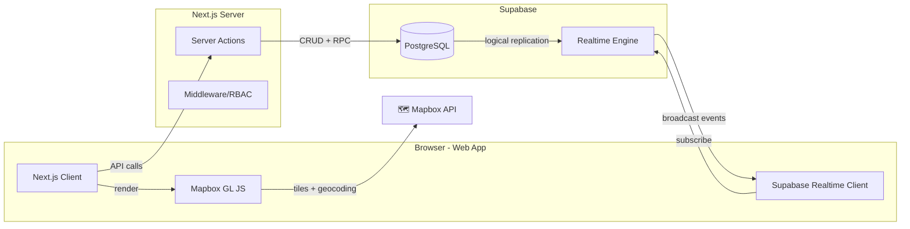

## Context

BFS Dispatch lacks any real-time tracking or notification capability. Currently:
- Load status changes are manual (dispatcher updates via form)
- Truck positions are unknown to dispatchers between status transitions
- Brokers/shippers must call to ask about load progress
- Fleet alerts are pull-based and ephemeral (computed on page load)
- No in-app notification infrastructure exists

This design introduces a checkpoint-based tracking system where drivers report positions from the web app, dispatchers view live positions on a Mapbox map, and shippers track loads via public URLs — all coordinated through Supabase Realtime.

**Existing infrastructure leveraged:**
- `loads` table (load_id, load_status, truck_id, driver_id, route_id)
- `load_status_history` (audit trail for status transitions)
- `trucks_with_availability` view (smart status)
- `employees` table (dispatcher identity)
- Supabase JS SDK (already installed, Realtime capabilities latent)
- RBAC system (admin, back_office, dispatcher, logistics, sales)

---

## System Context Diagram

```mermaid
flowchart LR
  driver[Chofer]
  dispatcher[Dispatcher]
  shipper[Shipper/Broker]
  bfs[💼 BFS Dispatch Web App]
  mapbox[🗺️ Mapbox API]
  supabase[⚡ Supabase DB + Realtime]

  driver -->|reporta checkpoint| bfs
  dispatcher -->|ve mapa + notificaciones| bfs
  shipper -->|abre /track/[token]| bfs
  bfs -->|renderiza mapa| mapbox
  bfs -->|guarda datos + broadcast| supabase
  supabase -->|publica Realtime| bfs
```

**Actors:**
- **Chofer**: Driver with an active load — reports position via web app checkpoints
- **Dispatcher**: Operations staff who monitors truck positions and receives notifications
- **Shipper/Broker**: External customer who views load progress via public tracking URL

**External Systems:**
- **Mapbox API**: Renders map tiles and geocoding (free tier up to 50k loads/month)
- **Supabase**: Database + Realtime (broadcast and presence)

---

## Container Diagram



**Containers:**
- **Next.js Client**: React Server Components + Client Components (tracking map, notification bell, driver checkpoint form)
- **Next.js Server**: Server actions for data mutations (`reportCheckpoint`, `getNotifications`, `markRead`)
- **Mapbox GL JS**: Client-side map rendering library
- **Supabase Realtime**: WebSocket-based broadcast for live checkpoint events
- **PostgreSQL**: Data persistence (`driver_checkpoints`, `notifications`, `loads`)

---

## Component Diagram (Tracking Module)

```mermaid
flowchart LR
  subgraph pages[Pages]
    trace[/traceability]
    track[/track/[token]]
    loads[/loads]
  end

  subgraph components[Components]
    tm[TrackingMap]
    nb[NotificationBell]
    cf[CheckpointForm]
    tp[TrackingPage]
  end

  subgraph actions[Server Actions]
    rc[reportCheckpoint]
    gt[getLoadTrack]
    gn[getNotifications]
    mr[markRead]
    gch[getCheckpointHistory]
  end

  subgraph db[Database Tables]
    dc[driver_checkpoints]
    notif[notifications]
    loads_t[loads]
    lsh[load_status_history]
  end

  trace --> tm
  trace --> nb
  loads --> nb
  track --> tp

  tm --> gch
  nb --> gn
  nb --> mr
  tp --> gt

  rc --> dc
  rc --> loads_t
  rc --> lsh
  gt --> dc
  gt --> loads_t
  gn --> notif
```

---

## Goals / Non-Goals

**Goals:**
1. Drivers can report position + status transitions (picked_up, delivered) from the web app
2. Dispatchers see live truck positions on a Mapbox map in `/traceability`
3. Dispatchers receive real-time in-app notifications when drivers report
4. Shippers/brokers track load progress via public `/track/[token]` URL
5. Notifications are persisted, have read/unread state, and survive page reload
6. Map markers color-code by checkpoint recency (green/amber/red)

**Non-Goals:**
- GPS background tracking (driver must actively report via web app)
- SMS/Email/push notifications (in-app only in this phase)
- Geofencing auto-status transitions (dispatcher must confirm)
- PostGIS or spatial queries (coordinates stored as decimal lat/lng)
- Real-time telemetry ingestion (no IoT devices or ELD integration)

---

## Decisions

### D1: Mapbox over Google Maps / Leaflet
- **Options**: Mapbox, Google Maps, Leaflet + OpenStreetMap
- **Chosen**: Mapbox (free tier: 50k loads/month)
- **Rationale**: Professional appearance, excellent React integration via `react-map-gl`, free tier sufficient for current scale. Leaflet is free but less polished. Google Maps requires billing account setup.

### D2: Supabase Realtime over polling / WebSocket server
- **Options**: Supabase Realtime, custom WebSocket server, polling every 10s
- **Chosen**: Supabase Realtime (broadcast channel)
- **Rationale**: Already have Supabase SDK installed. No additional infrastructure. Broadcast events are fire-and-forget which is ideal for checkpoint notifications. No need to persist message ordering or guarantee delivery.

### D3: UUID tracking tokens over JWT / short codes
- **Options**: UUID v4, JWT, numeric PIN, short alphanumeric code
- **Chosen**: UUID v4 stored in `loads.tracking_token` column
- **Rationale**: Non-guessable by nature. Simple to generate in DB (`gen_random_uuid()`). No signature verification needed (unlike JWT). Can be appended to load at creation time.

### D4: Decimal lat/lng over PostGIS geometry
- **Options**: `DECIMAL(10,8)` + `DECIMAL(11,8)`, PostGIS `geography(Point)`
- **Chosen**: Decimal columns
- **Rationale**: No spatial queries needed for MVP. Simpler migration, no PostGIS extension dependency. If geofencing is added later, a PostGIS migration can convert.

### D5: Notifications table over ephemeral Realtime-only
- **Options**: Persist to `notifications` table, in-memory only via Realtime
- **Chosen**: Persisted `notifications` table + Realtime broadcast
- **Rationale**: Notifications survive page reload. Dispatcher can see history. Read/unread state persists across sessions. Realtime provides instant delivery.

---

## Risks / Trade-offs

| Risk | Mitigation |
|------|-----------|
| [Mapbox rate limit] Exceed 50k free loads/month | Monitor usage in Mapbox dashboard. Upgrade to paid tier ($50/mo for 100k loads) or switch to Leaflet as fallback. |
| [Report frequency] Drivers forget to report | Add reminder notification after 4h without checkpoint. Dispatcher can manually ping driver. |
| [Token leakage] Tracking URL shared with unauthorized parties | Tokens are UUIDs (unguessable). No PII on tracking page. If leaked, dispatcher can regenerate token. |
| [Realtime disconnection] Client loses WebSocket connection | Realtime auto-reconnects. On reconnect, `getCheckpointHistory` fetches missed checkpoints. Notifications table is source of truth. |
| [Web app mobile UX] Drivers access from phone browser | Checkpoint form is responsive. Uses browser Geolocation API for lat/lng. No native app required. |

---

## Migration Plan

### Step 1: Database
- Run migration: CREATE `driver_checkpoints`, `notifications`, `notification_preferences` tables
- ALTER `loads` ADD `tracking_token UUID DEFAULT gen_random_uuid()`
- CREATE INDEX on `driver_checkpoints(load_id, recorded_at)`

### Step 2: Backend
- Create `lib/actions/tracking.ts`: `reportCheckpoint`, `getCheckpointHistory`, `getLoadTrack`
- Create `lib/actions/notifications.ts`: `getNotifications`, `markRead`, `markAllRead`, `createNotification`
- Update `createLoad` to set `tracking_token` on new loads

### Step 3: Frontend — Driver Checkpoint
- Create `CheckpointForm` component for driver to report position + status
- Integrate into load detail page or dedicated `/track/report/:loadId` page

### Step 4: Frontend — Notification System
- Create `NotificationProvider` context (wraps app, subscribes to Realtime channel)
- Create `NotificationBell` component for header
- Create toast component for real-time alerts

### Step 5: Frontend — Tracking Map
- Install `mapbox-gl` + `@types/mapbox-gl`
- Create `TrackingMap` component in `/traceability`
- Integrate Realtime subscription for live marker updates

### Step 6: Frontend — Customer Portal
- Create `app/(public)/track/[token]/page.tsx` (no auth required)
- Create `TrackingPage` client component with Mapbox mini-map
- Add public layout without sidebar/header

### Rollback
- Remove `tracking_token` column from `loads`
- Drop `driver_checkpoints` and `notifications` tables
- Remove Realtime subscriptions
- Remove Mapbox dependency
- Customer portal returns 404

---

## Open Questions

1. **Browser Geolocation**: Should the checkpoint form auto-detect position via `navigator.geolocation.getCurrentPosition()`, or require the dispatcher to manually enter lat/lng? Recommended: auto-detect with manual override.
2. **Token regeneration**: Should there be a "regenerar token" button on the load detail page? If so, old token stops working immediately.
3. **Checkpoint validation**: How precise should lat/lng validation be? Reject coordinates outside continental US bounds?
