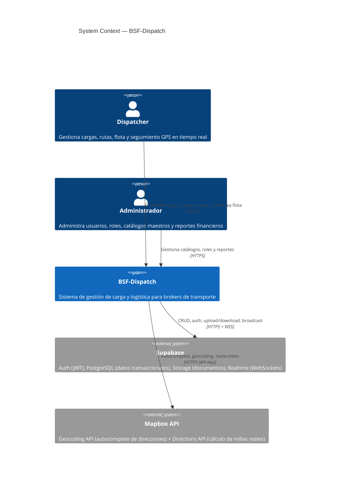
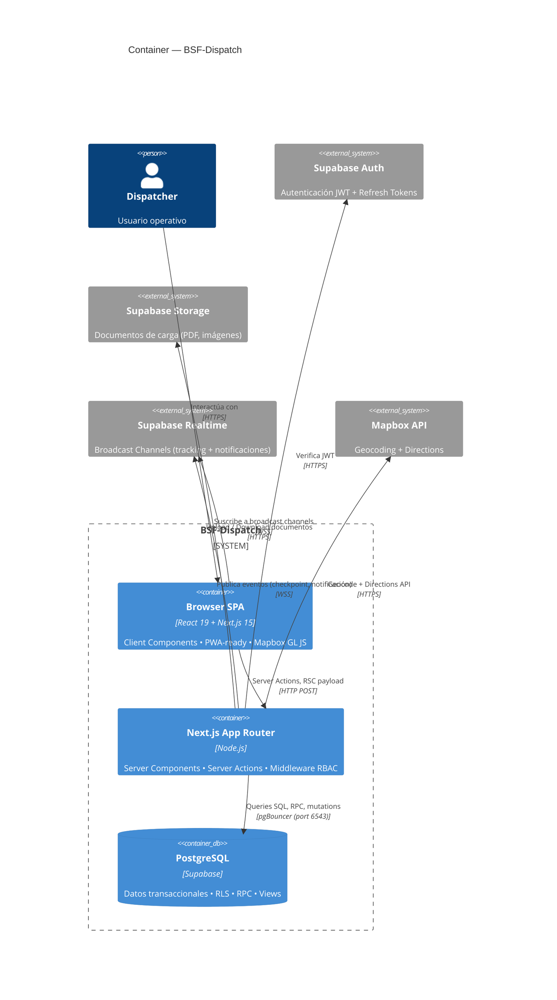

# BSF-Dispatch — Architecture Diagrams (C4 Model)

> Generated: 2026-06-03  
> Notation: [C4 Model](https://c4model.com/) rendered with [Mermaid C4](https://mermaid.js.org/syntax/c4.html)

---

## Level 1: System Context



---

## Level 2: Container



---

## Level 3: Component — Server Actions Layer

```mermaid
C4Component
  title Component — Server Actions Layer (lib/actions/)

  Container_Boundary(nextjs, "Next.js App Router") {
    Component(middleware, "middleware.ts", "Next.js Edge", "Autenticación JWT + RBAC por rol (admin, dispatcher, logistics, sales, back_office)")

    Component(barrel, "lib/actions.ts", "Barrel Re-export", "Único punto de importación público para Client Components")

    Component(core, "core.ts", "Server Client Factory", "Crea cliente Supabase SSR autenticado por request (cookies + getUser)")

    Component(loads, "loads.ts", "Cargas", "CRUD + search_loads RPC + change status")
    Component(routes, "routes.ts", "Rutas", "CRUD + calculateRouteMiles (Mapbox Directions)")
    Component(locations, "locations.ts", "Ubicaciones", "searchLocations + getOrCreateLocation (Mapbox place_id)")
    Component(fleet, "fleet.ts", "Flota", "Trucks, brokers, mantenimiento, contactos")
    Component(catalog, "catalog.ts", "Catálogos", "Carriers, drivers, estados, cargas activas")
    Component(tracking, "tracking.ts", "Tracking", "reportCheckpoint + getCheckpointHistory + getLoadTrack")
    Component(notif, "notifications.ts", "Notificaciones", "CRUD + Supabase Realtime broadcast")
    Component(docs, "documents.ts", "Documentos", "Upload/get/delete en Supabase Storage")
    Component(analytics, "analytics.ts", "Dashboard", "KPIs, revenue trends, rankings")
    Component(sales, "sales.ts", "Ventas", "v_sales_performance por mes/broker/estado")
    Component(reports, "reports.ts", "Reportes", "Agrupados por dispatcher/carrier/truck")
  }

  Container_Ext(react, "Client Components", "React 19", "LoadsPage, LoadForm, NewRouteModal, RouteSelector, TrackingMap, NotificationBell, Header")
  Container(browser_singleton, "lib/supabase-browser.ts", "Singleton", "Una instancia de createBrowserClient para toda la app")
  Container_Ext(auth_actions, "lib/auth-actions.ts", "Server Actions", "login/logout con redirect() — usa supabase-server.ts, no core.ts")
  ContainerDb_Ext(db, "PostgreSQL", "Supabase", "Tablas, vistas, RPC, RLS policies")

  Rel(react, barrel, "Importa acciones y tipos", "import {...} from '@/lib/actions'")
  Rel(react, browser_singleton, "Usa cliente browser compartido", "createSupabaseBrowserClient()")
  Rel(react, middleware, "Navega rutas protegidas", "HTTPS (cookie-based auth)")

  Rel(barrel, loads, "Re-exporta", "")
  Rel(barrel, routes, "Re-exporta", "")
  Rel(barrel, locations, "Re-exporta", "")
  Rel(barrel, fleet, "Re-exporta", "")
  Rel(barrel, catalog, "Re-exporta", "")
  Rel(barrel, tracking, "Re-exporta", "")
  Rel(barrel, notif, "Re-exporta", "")
  Rel(barrel, docs, "Re-exporta", "")
  Rel(barrel, analytics, "Re-exporta", "")
  Rel(barrel, sales, "Re-exporta", "")
  Rel(barrel, reports, "Re-exporta", "")

  Rel(loads, core, "Usa", "getSupabaseServerClient()")
  Rel(routes, core, "Usa", "")
  Rel(locations, core, "Usa", "")
  Rel(fleet, core, "Usa", "")
  Rel(catalog, core, "Usa", "")
  Rel(tracking, core, "Usa", "")
  Rel(notif, core, "Usa", "")
  Rel(docs, core, "Usa", "")
  Rel(analytics, core, "Usa", "")
  Rel(sales, core, "Usa", "")
  Rel(reports, core, "Usa", "")

  Rel(core, db, "SQL queries, RPC calls", "pgBouncer")
  Rel(browser_singleton, db, "Realtime subscriptions", "WSS")
  Rel(middleware, db, "get_user_role_type() RPC", "pgBouncer")
  Rel(middleware, auth_actions, "Redirige a login si no auth", "")

  UpdateRelStyle(barrel, loads, $offsetY="-20")
  UpdateRelStyle(barrel, routes, $offsetY="-15")
  UpdateRelStyle(barrel, locations, $offsetY="-10")
```



---

## Technology Stack Summary

| Layer | Technology | Version |
|-------|-----------|---------|
| Frontend Framework | Next.js (App Router) | 15.x |
| UI Library | React | 19.x |
| Component System | shadcn/ui + Tailwind CSS | 4.x |
| Maps | Mapbox GL JS (native, no wrapper) | 3.x |
| Database | PostgreSQL (Supabase) | 15.x |
| Auth | Supabase Auth (JWT + RLS) | — |
| Realtime | Supabase Broadcast Channels | — |
| Storage | Supabase Storage (S3-compatible) | — |
| Testing | Vitest + Testing Library | 4.x |
| Type Safety | TypeScript + generated DB types | 5.x |
| Validation | Zod (client + server dual) | 3.x |
| PWA | Static manifest.json | — |

## Key Architectural Decisions

| ADR | Decision | File |
|-----|----------|------|
| ADR-010 | Server Actions separados por dominio (12 archivos + barrel) | `adr/ADR-010-server-actions-domain-separation.md` |
| ADR-011 | Singleton para cliente Supabase browser | `adr/ADR-011-supabase-browser-singleton.md` |
| ADR-012 | Vitest + funciones puras en `calculations.ts` + roadmap MSW | `adr/ADR-012-testing-infrastructure-pure-functions.md` |
| ADR-0007 | Tabla `locations` denormalizada (reemplaza addresses/streets/cities) | `adr/0007-use-denormalized-locations-table.md` |
| ADR-0008 | Mapbox Directions API para geometría real de rutas | `adr/0008-mapbox-directions-api-for-real-route-lines.md` |
| ADR-0009 | `schema.sql` como source of truth del esquema DB | `adr/0009-schema-sql-as-source-of-truth.md` |

## Data Flow Patterns

### Mutation Flow (Server Action)
```
Client Component
  → import { createLoad } from "@/lib/actions"
    → "use server" function in lib/actions/loads.ts
      → Zod validation (createLoadSchema)
        → getSupabaseServerClient() from core.ts
          → supabase.from("loads").insert(...)
            → PostgreSQL (RLS enforced)
              → Return { success: true, load_id } | { error, errors }
```

### Read Flow (Server Component or Server Action)
```
Page / Component
  → import { getRoutesWithDetails } from "@/lib/actions"
    → "use server" function in lib/actions/routes.ts
      → getSupabaseServerClient() from core.ts
        → supabase.from("routes").select("*, locations!...")
          → PostgreSQL → throws on error (Error Boundary catches)
            → Return typed data (RouteWithDetails[])
```

### Realtime Flow (Broadcast)
```
reportCheckpoint (Server Action)
  → INSERT INTO driver_checkpoints
    → supabase.channel("load-tracking:<load_id>").send({ type: "broadcast", event: "checkpoint", payload })
      → Client Component suscribed to "load-tracking:<load_id>"
        → Toast notification + map update
```
