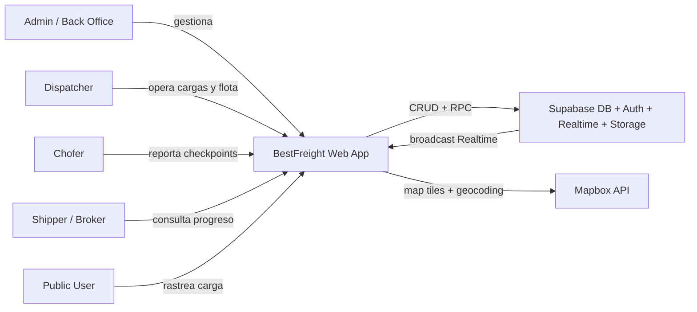
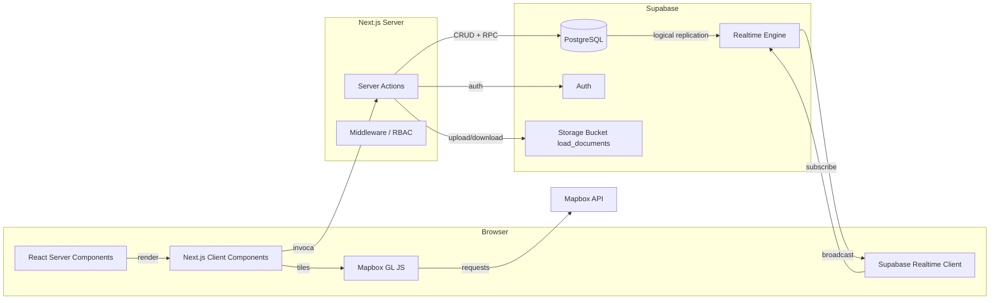

# BFS Dispatch — System Design

> Baseline architecture for the BestFreight dispatch management platform.
> Next.js 16 App Router + Supabase PostgreSQL + Mapbox.

---

## System Context Diagram



**Actors:**
- **Admin / Back Office**: Configuración, HR, reportes ejecutivos, acceso total.
- **Dispatcher**: Operador de carga. Gestiona loads, flota, tracking.
- **Chofer**: Driver con carga activa. Reporta checkpoints desde web app.
- **Shipper / Broker**: Cliente externo. Recibe progreso o usa URL pública.
- **Public User**: Cualquier persona con token UUID puede rastrear una carga.

**External Systems:**
- **Supabase**: PostgreSQL, Auth, Realtime (WebSocket broadcast), Storage (PDF documents).
- **Mapbox API**: Tiles, geocoding, map rendering (free tier 50k loads/month).

---

## Container Diagram



**Containers:**
- **Next.js Client Components**: Forms, tablas, mapas, dashboards, notificaciones. Browser-side React.
- **React Server Components**: Páginas principales que renderizan datos desde Server Actions.
- **Server Actions**: Funciones `"use server"` en `lib/actions/`. Backend sin API REST explícita.
- **Middleware/RBAC**: Edge middleware. Verifica JWT + rol desde `get_user_role_type()`.
- **PostgreSQL**: Datos persistentes. RLS habilitado por tabla.
- **Supabase Realtime**: Broadcast de checkpoints y notificaciones vía WebSocket.
- **Supabase Storage**: Bucket `load_documents` para PDFs (RC, BOL, POD).

---

## Component Diagram (Logical Modules)

```mermaid
flowchart LR
  subgraph pages[Pages / RSC]
    dash[/dashboard]
    exec[/executive]
    loads_p[/loads]
    carriers_p[/carriers]
    drivers_p[/drivers]
    brokers_p[/brokers]
    trucks_p[/trucks]
    trace[/traceability]
    track[/track/[token]]
    reports_p[/reports]
    hr[/human-resources]
  end

  subgraph actions[Server Actions]
    loads_a[loads.ts]
    catalog[catalog.ts]
    routes[routes.ts]
    fleet[fleet.ts]
    docs[documents.ts]
    sales[sales.ts]
    analytics[analytics.ts]
    reports_a[reports.ts]
    tracking[tracking.ts]
    notif[notifications.ts]
  end

  subgraph hooks[Hooks]
    useLoads[useLoads]
    useAccess[useHasAccess]
    useRole[useUserRole]
    useErr[useApiError]
  end

  subgraph db[Database / RPC]
    loads_t[(loads)]
    trucks_t[(trucks)]
    carriers_t[(carriers)]
    drivers_t[(drivers)]
    brokers_t[(brokers)]
    routes_t[(routes)]
    checkpoints_t[(driver_checkpoints)]
    notif_t[(notifications)]
  end

  dash --> analytics
  exec --> analytics
  loads_p --> loads_a
  loads_p --> useLoads
  carriers_p --> catalog
  drivers_p --> catalog
  brokers_p --> fleet
  trucks_p --> fleet
  trace --> fleet
  trace --> tracking
  track --> tracking
  reports_p --> reports_a
  hr --> catalog

  loads_a --> loads_t
  catalog --> carriers_t
  catalog --> drivers_t
  catalog --> brokers_t
  routes --> routes_t
  fleet --> trucks_t
  docs --> storage
  tracking --> checkpoints_t
  notif --> notif_t
```

---

## Goals

1. Gestión end-to-end de cargas de transporte (CRUD, estados, documentos, historial).
2. Seguimiento de flota en tiempo real con mapa (Mapbox) y checkpoints.
3. Portal público de rastreo por token UUID sin requerir login.
4. Reportes financieros por dispatcher, carrier y camión con exportación.
5. Dashboard ejecutivo con KPIs comparativos y sparklines.
6. Sistema de notificaciones in-app persistentes con real-time.
7. RBAC con 5 roles (admin, back_office, dispatcher, logistics, sales).
8. Soft delete universal y auditoría de cambios de estado de cargas.
9. Numeración atómica de cargas (`LD-YYYY-NNNN`) vía secuencia PostgreSQL.

## Non-Goals

- GPS background tracking (el chofer debe reportar activamente vía web).
- SMS / Email / Push notifications (solo in-app en esta fase).
- ELD (Electronic Logging Device) integration.
- Geofencing con auto-transición de estados (dispatcher confirma manualmente).
- PostGIS o queries espaciales avanzadas (coordenadas como decimal lat/lng).
- Multi-tenancy (un solo tenant actualmente).
- Facturación electrónica automática o integración contable.

---

## Decisions

### D1: Next.js App Router + Server Actions sobre API REST explícita
- **Opciones**: API REST tradicional (`app/api/*`), tRPC, GraphQL, Server Actions.
- **Elegido**: Server Actions con Next.js App Router.
- **Rationale**: Menor boilerplate. Type safety end-to-end sin generación de SDK. Las actions viven junto al código que las consume. No se necesita una capa de routing de API separada para un CRUD interno.

### D2: Supabase SSR con cookies sobre token-based auth
- **Opciones**: JWT en localStorage, Supabase SSR con cookies, Auth0, Clerk.
- **Elegido**: Supabase Auth con cookie-based SSR (`@supabase/ssr`).
- **Rationale**: Seguridad CSRF mejorada. El middleware Edge puede verificar sesión antes de renderizar. Las server actions comparten el mismo contexto de cookie sin pasar tokens manualmente.

### D3: Soft deletes con `status_id` sobre DELETE físico
- **Opciones**: DELETE físico, soft delete con columna `deleted_at`, soft delete con `status_id` referenciando `record_status`.
- **Elegido**: `status_id` referenciando catálogo `record_status` (1=Activo, 2=Inactivo).
- **Rationale**: Consistencia con el esquema Oracle heredado. Un solo patrón para todas las entidades. Permite reactivación. Las vistas y funciones de búsqueda filtran automáticamente por `status_id = 1`.

### D4: Numeración atómica de cargas con secuencia + trigger
- **Opciones**: Generación en aplicación (race conditions), UUID, MAX()+1, secuencia PostgreSQL.
- **Elegido**: `loads_seq` START 1 + trigger `BEFORE INSERT` que genera `LD-<YYYY>-<NNNN>`.
- **Rationale**: Atómico, sin race conditions, sin locks de aplicación. El formato es legible para operadores.

### D5: `dispatch_fee` calculado server-side sobre columna almacenada
- **Opciones**: Columna `dispatch_fee` en `loads`, calcular en frontend, calcular en backend.
- **Elegido**: No almacenar `dispatch_fee` en `loads`; calcular como `rate * carrier.dispatch_fee_percent / 100` en server actions.
- **Rationale**: Evita data inconsistency si cambia el `dispatch_fee_percent` del carrier. Fuente única de verdad en `carriers.dispatch_fee_percent`.

---

## Risks / Trade-offs

| Risk | Mitigation |
|------|-----------|
| Supabase como dependencia total | Monitorear límites de free tier. Plan de migración a RDS + Auth propio documentado pero no priorizado. |
| Schema TypeScript manual | `types/database.types.ts` se mantiene a mano. Riesgo de drift. Mitigación: revisar diff tras cada migración SQL. |
| Mobile UX solo vía browser | Checkpoint form es responsive. Geolocation API del navegador. No se requiere app nativa en MVP. |
| Mapbox rate limits (50k loads/mes) | Monitorear dashboard de Mapbox. Fallback a Leaflet si se excede. |
| Acoplamiento server actions a PostgreSQL | Difícil cambiar de BD sin reescribir actions. Aceptado dado que Supabase es elección estratégica a largo plazo. |

---

## Migration Plan

### Deploy inicial (ya realizado)
- PostgreSQL schema creado desde `supabase/schema.sql`.
- Migraciones posteriores aplicadas secuencialmente (`migration.sql`, `rbac-migration.sql`, etc.).
- Next.js 16 App Router migrado de versiones anteriores.
- Dependencias actualizadas a Zod v4, Tailwind v4, React 19.

### Rollback considerations
- Todas las migraciones SQL son reversibles (ALTER revertibles, nuevas tablas dropeables).
- Soft delete permite recuperación lógica sin backup de filas.
- `load_number` no se reutiliza (secuencia monótona) — acceptable.

---

## Open Questions

1. **Generación automática de tipos**: ¿Se debería integrar `supabase gen types` en CI para evitar drift de `database.types.ts`?
2. **Tests de integración**: Vitest + jsdom cubre unitarios. ¿Cuándo agregar MSW para mock de Supabase en server actions?
3. **E2E**: Playwright no está instalado. ¿Prioridad para flujos críticos (login → create load → change status)?
4. **Escalabilidad de notificaciones**: `notifications` table crece sin límites. ¿Agregar retention policy o archivo?
5. **Sales / Billing / Invoicing**: El schema tiene tablas de ventas y facturación. ¿Hay UI planificada o quedó en desuso?
